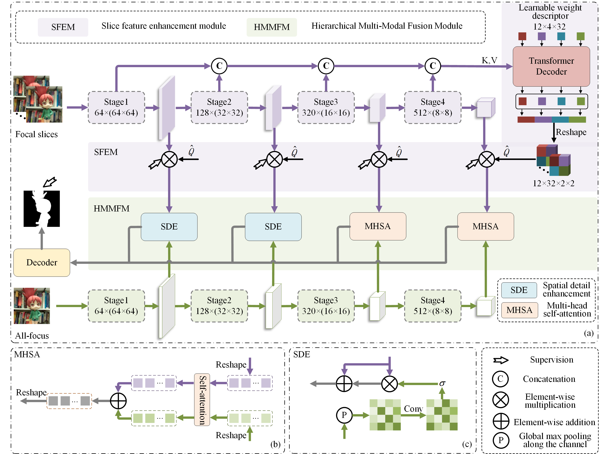

# LFTransNet: Light Field Salient Object Detection via a Learnable Weight Descriptor
The paper has been accepted by IEEE Transactions on Circuits and Systems for Video Technology.
https://ieeexplore.ieee.org/document/10138590

DOI:10.1109/TCSVT.2023.3281465


## Training Set and Testing Set
链接：https://pan.baidu.com/s/1xKowe-mUi8FATLMXX9WMSg 
提取码：t3pr 


##  PVT Parameters
链接：https://pan.baidu.com/s/10JVtKkJSHknY83Nijjm5kw 
提取码：g2od 

##  Model Parameters
链接：https://pan.baidu.com/s/1X_d7-lAcmhuH7J0MBiapBw 
提取码：yo1k 


##  Result Saliency Maps 

链接：https://pan.baidu.com/s/19sIc9VAY46Zt-rJilMaazA 
提取码：94xe 


## Evaluation Code

链接：https://pan.baidu.com/s/1X8pCyFCUIjQT_8Rbndk4Mw 
提取码：qw5p 


### Citation

If you find the information useful, please consider citing:
```
@article{liu2023,
  author={Liu, Zhengyi and He, Qian and Wang, Linbo and Fang, Xianyong and Tang Bin},
  journal={IEEE Transactions on Circuits and Systems for Video Technology}, 
  title={LFTransNet: Light Field Salient Object Detection via a Learnable Weight Descriptor}, 
  pages={1--10},
  year={2023}}
```
If you have any question, please email  liuzywen@ahu.edu.cn
